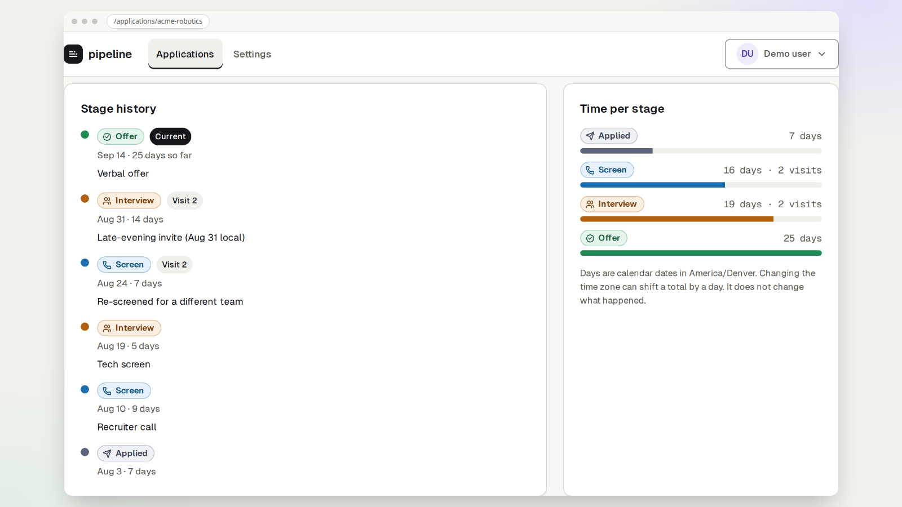

# pipeline

A job-search pipeline that keeps stage history instead of overwriting a status.



Sign in, or try the demo, and move an application through Applied, Screen, Interview, Offer, and Closed. The README image is captured from a local test build with `npm run readme-hero`. Set `HERO_BASE_URL` to recapture it against a deployed origin.

## Run locally

1. Create a Postgres database and copy the env file.

```bash
cp .env.example .env
```

2. Set `DATABASE_URL`, `SESSION_SECRET`, and `ENCRYPTION_KEY` in `.env`. Placeholders are in `.env.example`. Do not commit `.env`.

3. Install, migrate, and start the API and the client.

```bash
npm install
npm run db:migrate
npm run dev
```

The client runs at <http://localhost:5173> and proxies `/api` to the server on port 3000. Dev mail is printed to the server console because `RESEND_API_KEY` is unset. Tests use an in-memory mail sink instead.

## Stack

React 18, TypeScript, Vite, Tailwind CSS, TanStack Query, React Router, Hono, Drizzle, Postgres, zod, argon2id, vitest, Playwright.

## Deploy

`render.yaml` defines one Render web service. Postgres is external Neon, passed in as `DATABASE_URL`. There is no Render database. Set the env vars from `.env.example` on the service. `APP_URL` is the public https origin. Production mail requires `RESEND_API_KEY`. The client IP is `TRUSTED_PROXY_HOPS` entries from the right of `X-Forwarded-For`. `0` ignores that header and uses the socket address. Unset defaults to `0`. Render sets `1`, which is correct only because Render's proxy is the sole route to the app. A wrong hop count reopens IP spoofing. See `docs/SECURITY.md`.

I made history append-only so days-in-stage stays honest when a stage is revisited.

I made stages a fixed enum, not user-defined, so the demo stays small.

Notes live on the application and optionally on a stage event: the event note is what changed, the application note is the running summary.
